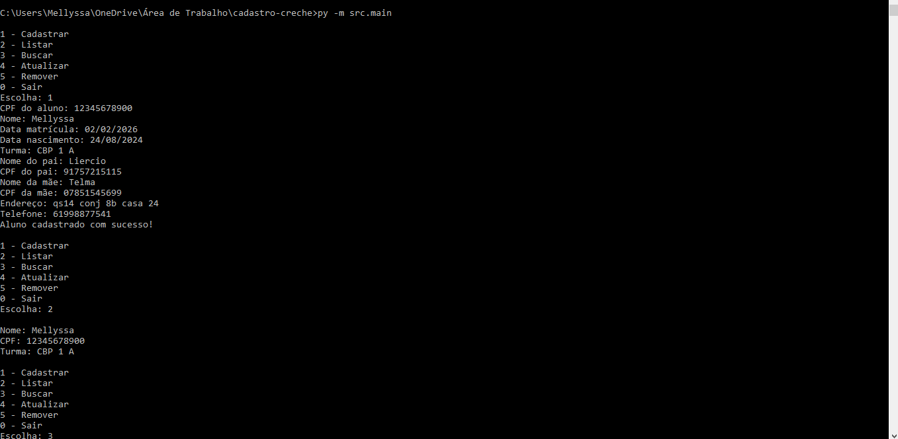
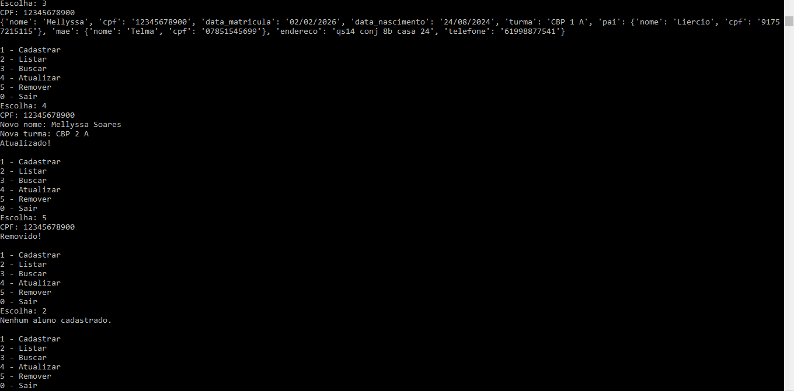
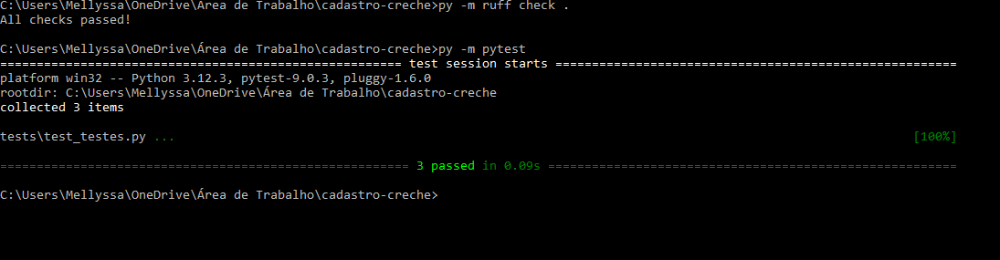

# Cadastro de Alunos

## Descrição

Sistema simples em Python para registrar, consultar e gerenciar alunos, facilitando o controle acadêmico de uma creche em pequenos contextos educacionais.

---

## Demonstração

### Sistema funcionando




### Testes automatizados



---

## Problema

Uma escola enfrenta dificuldades na gestão de alunos por utilizar métodos manuais e planilhas, o que torna o processo lento e suscetível a erros.

---

## Solução

A plataforma oferece uma forma simples e eficiente de gerenciar alunos, facilitando processos como matrícula, atualização de dados e desligamento.

---

## Público-Alvo

* Secretaria escolar
* Pequenas instituições de ensino

---

## Funcionalidades

* Cadastrar aluno
* Remover aluno
* Atualizar dados
* Buscar aluno
* Listar alunos

---

## Tecnologias

* Python 3.12
* JSON (armazenamento de dados)
* Pytest (testes automatizados)
* Ruff (análise de código)
* GitHub Actions (CI/CD)

---

## Estrutura do Projeto

```
cadastro-creche/
cadastro-creche/
│
├── src/                     
│   ├── main.py
│   ├── alunos.json
│   └── __init__.py
│
├── tests/                  
│   └── testes.py
│
├── .github/workflows/       
│   └── ci.yml
│
├── assets/                  
│   ├── sistema.png
│   ├── sistema2.png
│   └── testes.png
│
├── README.md
├── requirements.txt
├── .gitignore
├── pytest.ini
├── ruff.toml
├── CHANGELOG.md
├── LICENSE
└── VERSION

---

## Como executar o projeto

```
py src/main.py
```

---

## Como executar os testes

```
py -m tests.testes
```
##Como executar ruff
ruff check .
```

#Licença

Este projeto está licenciado sob a licença MIT.
---

## Requisitos

* Python 3.12 ou superior

---

## Instalação

Clone o repositório:

```
git clone https://github.com/Mellyssa01/cadastro-creche.git
```

Acesse a pasta:

```
cd cadastro-creche
```

Instale as dependências:

```
pip install -r requirements.txt
```

---
## Cobertura dos testes

* **Validação de cadastro:** verifica o comportamento do sistema ao cadastrar alunos, incluindo casos com CPF inválido, garantindo que os dados são armazenados conforme a lógica atual.

* **Persistência de dados:** testa se as informações são corretamente salvas e recuperadas do arquivo JSON, assegurando a integridade dos dados.

* **Tratamento de dados vazios:** garante que o sistema funciona corretamente mesmo sem registros, retornando listas vazias sem erros.
---

## Melhorias futuras

* Interface gráfica
* Validação de CPF
* Integração com banco de dados
* Sistema de login

---

## Autora

Mellyssa Silva Soares
