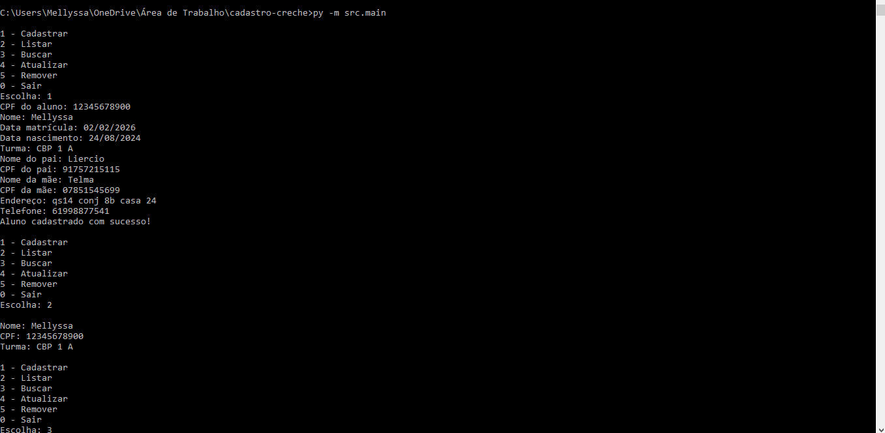
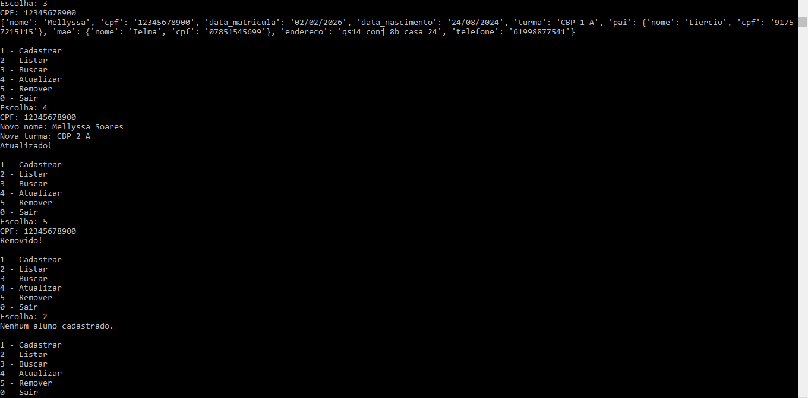
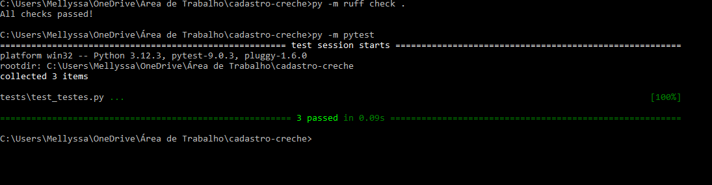

# Cadastro de Alunos

## Descrição

Sistema simples em Python para registrar, consultar e gerenciar alunos, facilitando o controle acadêmico de uma creche em pequenos contextos educacionais.

---
## Atualização
## Evolução da Aplicação — Etapa Intermediária

Nesta etapa intermediária, o foco do projeto foi a evolução estruturada e a entrega contínua do sistema, conectando a aplicação a serviços externos, garantindo a qualidade do código com testes automatizados e aplicando linters para padronização.

Abaixo estão detalhadas todas as alterações e adições realizadas no projeto:

### 1. Integração com API Pública
* **O que foi adicionado:** Implementação da função `buscar_endereco_por_cep(cep)` no arquivo `src/main.py`.
* **Funcionamento técnico:** A função consome a API REST pública do ViaCEP de forma síncrona através da biblioteca nativa `urllib.request`. Ela realiza uma requisição HTTP GET utilizando blocos de try-except para tratar o retorno em formato JSON.
* **Impacto no fluxo:** Durante o cadastro do aluno, o sistema agora oferece a opção de autocompletar o endereço. Se o usuário fornecer um CEP válido, o programa extrai as chaves de logradouro, bairro, localidade e UF para preencher o campo automaticamente.

### 2. Testes de Integração Automatizados
* **O que foi adicionado:** Criação de novos testes focados na validação da comunicação externa (`test_busca_cep_valido_integracao` e `test_busca_cep_invalido_integracao`).
* **Funcionamento técnico:** Diferente dos testes unitários ou funcionais que rodam isolados localmente, estes testes de integração fazem requisições reais de rede para os servidores do ViaCEP para garantir que o contrato da API não quebrou e que o parsing dos dados continua correto.
* **Ajustes nos testes existentes:** O teste funcional anterior (`test_cpf_invalido_funcional`) foi atualizado com novos valores na lista de inputs simulados via `unittest.mock.patch`, adequando o mock ao novo fluxo de perguntas do terminal.

### 3. Tratamento de Exceções e Resiliência
* **O que foi alterado:** A função `cadastrar_aluno` foi modificada para receber o retorno tratado da API de CEP.
* **Mecanismo de fallback:** Se a API falhar, o CEP não existir ou o sistema estiver sem conectividade com a internet, a aplicação captura o erro de forma segura através de exceções genéricas e permite o preenchimento manual, garantindo que o programa não sofra crash em tempo de execução.

### 4. Padronização de Estilo de Código (Linting)
* **O que foi configurado:** Integração do projeto com o linter Ruff e correção do arquivo de configuração `tests/ruff.toml`.
* **Correção efetuada:** Foi corrigido um erro de sintaxe na propriedade de tamanho máximo de linha (ajustado para `line-length = 88`), adequando o projeto às diretrizes da PEP 8. Isso garante que a pipeline de CI no GitHub Actions execute a checagem sem falhas de carregamento de configuração.
  ### 5. Deploy
   

## Demonstração

### Sistema funcionando




### Testes automatizados



---

## Problema

Uma escola enfrenta dificuldades na gestão de alunos por utilizar métodos manuais e planilhas, o que torna o processo lento e suscetível a erros.

---

## Solução

A plataforma oferece uma forma simples e eficiente de gerenciar alunos, facilitando processos como matrícula, atualização de dados e desligamento.

---

## Público-Alvo

* Secretaria escolar
* Pequenas instituições de ensino

---

## Funcionalidades

* Cadastrar aluno
* Remover aluno
* Atualizar dados
* Buscar aluno
* Listar alunos

---

## Tecnologias

* Python 3.12
* JSON (armazenamento de dados)
* Pytest (testes automatizados)
* Ruff (análise de código)
* GitHub Actions (CI/CD)

---

## Estrutura do Projeto

```
cadastro-creche/
cadastro-creche/
│
├── src/                     
│   ├── main.py
│   ├── alunos.json
│   └── __init__.py
│
├── docs/                     
│   ├── index.html
│   └── style.css
|
├── tests/                  
│   └── testes.py
│
├── .github/workflows/       
│   └── ci.yml
│
├── assets/                  
│   ├── sistema.png
│   ├── sistema2.png
│   └── testes.png
│
├── README.md
├── requirements.txt
├── .gitignore
├── pytest.ini
├── ruff.toml
├── CHANGELOG.md
├── LICENSE
└── VERSION

---

## Como executar o projeto

```
py src/main.py
```

---

## Como executar os testes

```
py -m pytest
```
##Como executar ruff
py -m ruff check .
```

#Licença

Este projeto está licenciado sob a licença MIT.
---

## Requisitos

* Python 3.12 ou superior

---

## Instalação

Clone o repositório:

```
git clone https://github.com/Mellyssa01/cadastro-creche.git
```

Acesse a pasta:

```
cd cadastro-creche
```

Instale as dependências:

```
pip install -r requirements.txt
```

---
## Cobertura dos testes

* **Validação de cadastro:** verifica o comportamento do sistema ao cadastrar alunos, incluindo casos com CPF inválido, garantindo que os dados são armazenados conforme a lógica atual.

* **Persistência de dados:** testa se as informações são corretamente salvas e recuperadas do arquivo JSON, assegurando a integridade dos dados.

* **Tratamento de dados vazios:** garante que o sistema funciona corretamente mesmo sem registros, retornando listas vazias sem erros.
---

## Melhorias futuras

* Interface gráfica
* Validação de CPF
* Integração com banco de dados
* Sistema de login

---

## Autora

Mellyssa Silva Soares
